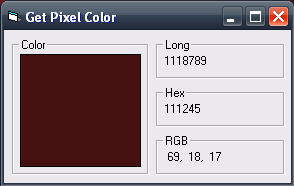

## A way to get pixel color on the screen\.

### Description

Get Pixel Color.

Get Mouse Position.

Get Color of the pixel the mouse is on.

Show Long, Hex, and RGB Color Codes.
 
### More Info
 

             |
---                |---
**Submitted On**   |2007-02-02 07:42:30
**By**             |[Richard V\.](https://github.com/Planet-Source-Code/PSCIndex/blob/master/ByAuthor/richard-v.md)
**Level**          |Beginner
**User Rating**    |5.0 (25 globes from 5 users)
**Compatibility**  |VB 6\.0
**Category**       |[Miscellaneous](https://github.com/Planet-Source-Code/PSCIndex/blob/master/ByCategory/miscellaneous__1-1.md)
**World**          |[Visual Basic](https://github.com/Planet-Source-Code/PSCIndex/blob/master/ByWorld/visual-basic.md)
**Archive File**   |[A\_way\_to\_g204595222007\.zip](https://github.com/Planet-Source-Code/richard-v-a-way-to-get-pixel-color-on-the-screen__1-67567/archive/master.zip)

### API Declarations

yes.

